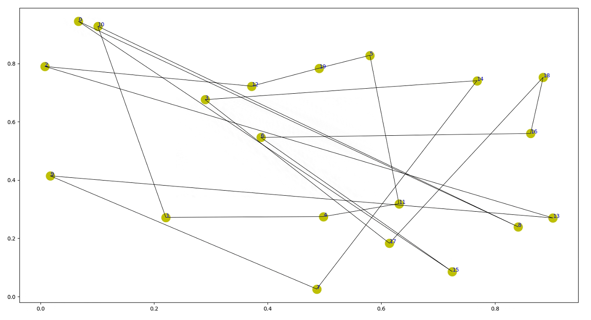
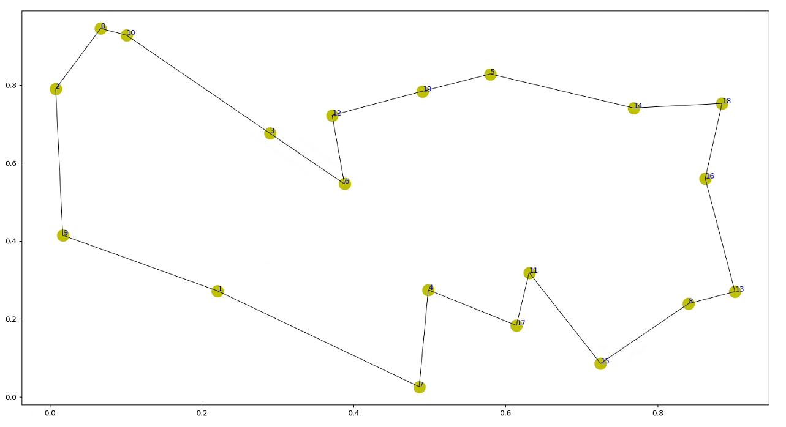

# Pointer Networks(NIPS 2015)
## 原文链接：https://github.com/Rintarooo/TSP_DRL_PtrNet
具体内容见上述Python代码

# 环境
- GPU：RTX 2080 Ti
- Python = 3.6.10
- Pytorch = 1.6.0
- numpy
- tqdm
- matplotlib

# 训练
## 1. 设置参数
```
python config.py -m train -b 512 -t 20 -s 13000
```

## 2. 训练模型
```
python train.py -p Pkl/train20.pkl
```

# 测试
## 1. 导入模型
```
python config.py -m test -t 20 -s 10 -ap Pt/train20_1113_12_12_step14999_act.pt --islogger --seed 123
```
## 2. 测试
```
python test.py -p Pkl/test20.pkl
```

# 结果
随机生成20个城市节点（坐标位于0-1之间），以下有两种路径生成方法，结果如下：
    
1. 随机生成路径，路径长度：11.591
    

    
2. 指针网络生成路径，路径长度：3.934
    


# Citation
```
@inproceedings{NIPS2015_29921001,
 author = {Vinyals, Oriol and Fortunato, Meire and Jaitly, Navdeep},
 booktitle = {Advances in Neural Information Processing Systems},
 editor = {C. Cortes and N. Lawrence and D. Lee and M. Sugiyama and R. Garnett},
 pages = {},
 publisher = {Curran Associates, Inc.},
 title = {Pointer Networks},
 url = {https://proceedings.neurips.cc/paper_files/paper/2015/file/29921001f2f04bd3baee84a12e98098f-Paper.pdf},
 volume = {28},
 year = {2015}
}
```
